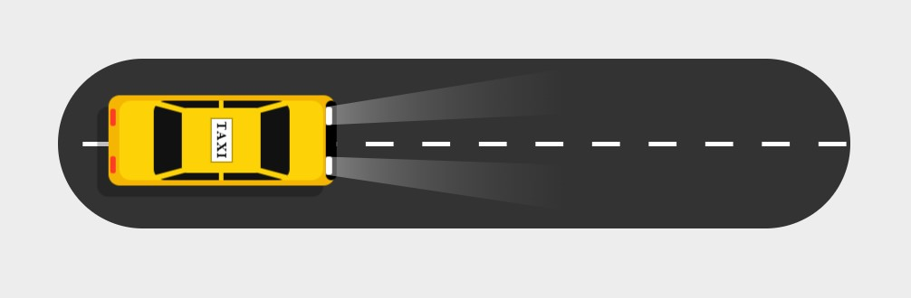

  

# Taxi Animado en HTML y CSS

  

  
  
  

## ¿Cuál es el fin de este proyecto?
Este proyecto se creó con fines de aprendizaje usando HTML y CSS, es un txi hecho 100% en CSS que recorre una carretera con las luces encendidas 

## ¿Puedo Probarlo en Linea? 
Si, Puedes probarlo en linea haciendo click [aqui](https://carlosorellana00.github.io/Taxi-Animado-en-HTML-y-CSS/)

## Referencias y Agradecimientos a: 
- [Online Tutorials](https://www.youtube.com/c/OnlineTutorials4Designers)
- [video origina -> CSS Only Taxi Animation Effects | Html CSS Moving Car Animation Effect @Online Tutorials](https://www.youtube.com/watch?v=WJqd8Sof7lE)
